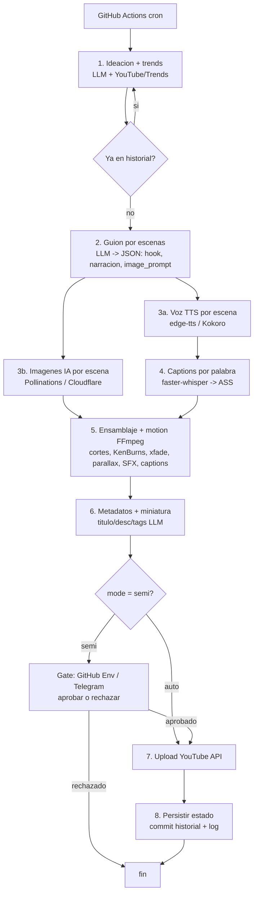

# Plan de Arquitectura — Agente Autónomo de YouTube Shorts (coste de operación ~0 €)

> Documento de diseño. Aún **no** se ha escrito código. Sirve para validar enfoque, stack y despliegue antes de implementar.
>
> **Configuración fijada:**
> - **Idioma:** inglés (2º canal en español como opción futura).
> - **Visual:** **imágenes IA + montaje muy dinámico** (no slideshow).
> - **Nicho:** **"did you know" / datos curiosos** (espacio, cuerpo humano, ciencia, historia).
> - **Automatización:** **modo conmutable** `semi | auto`.
> - **Frecuencia:** 1–3 Shorts/día.

---

## 1. Contexto y objetivo

Un sistema autónomo que, de forma recurrente:

1. Genera ideas virales de **datos curiosos** (con señal de tendencias).
2. Escribe el **guion** (hook + narración por escenas + *prompt de imagen* por escena).
3. Reúne los **assets** (imágenes IA + voz TTS + subtítulos animados + música + SFX).
4. **Ensambla un Short** vertical 9:16 (1080×1920) con **motion design agresivo** (cortes rápidos, Ken Burns, transiciones, parallax, captions karaoke).
5. **Sube** el Short a YouTube con título, descripción, tags y miniatura.
6. Registra **estado/historial** para no repetir ideas y poder auditar.

**Restricciones:** lo más *profesional / enterprise* posible y **coste de operación ≈ 0 €**.

### Tensión honesta que debes conocer

- **"Coste 0" + "enterprise" están en tensión.** Lo profesional está en *cómo* se construye (arquitectura, CI/CD, IaC, observabilidad, secrets), no en el gasto. Los tiers gratis tienen *rate limits* y dependen de terceros.
- **Imágenes ≠ vídeo aburrido.** El dinamismo no viene de la imagen sino del **montaje**: cortes al ritmo de la narración, zoom/pan, transiciones con punch, **parallax 2.5D** y **captions palabra a palabra**. Todo con FFmpeg gratis.
- **Ventaja de imágenes IA sobre vídeo de stock:** libertad creativa total (cualquier escena/tema), **cero riesgo de copyright** (generado) y coste casi nulo. Trade-off: el movimiento es *simulado*, no real → se compensa con motion design.
- **Política de YouTube (riesgo nº1).** Endurecida en 2025–26 contra *contenido inauténtico / producido en masa*. Mitigación: alta variación de plantillas, valor informativo real (datos verificados), edición original y **gate humano** al inicio (`mode: semi`).

---

## 2. Decisiones fijadas

| # | Decisión | Valor | Implicación |
|---|----------|-------|-------------|
| D1 | **Idioma** | Inglés (ES futuro) | Voz TTS y prompts en EN |
| D2 | **Visual** | **Imágenes IA + motion dinámico** | Generación de imágenes + FFmpeg avanzado |
| D3 | **Nicho** | **Did-you-know / datos curiosos** | Knowledge base de subtemas (espacio, cuerpo, ciencia, historia) |
| D4 | **Automatización** | Conmutable `mode: semi | auto` | `semi` = gate de aprobación; `auto` = publica solo |
| D5 | **Frecuencia** | 1–3 Shorts/día | Cuota YouTube da hasta 6/día |

---

## 3. Nicho e ideas virales (automatizable, gratis)

1. **Knowledge base** versionada (`knowledge/niche.yaml`): subtemas de datos curiosos (espacio, océano profundo, cuerpo humano, historia, animales raros, psicología, física cotidiana…).
2. **Señal de demanda gratuita:** `search.list` de YouTube (100 u.) + Google Trends (`pytrends`) + opcional Reddit (r/todayilearned, r/Damnthatsinteresting) para ángulos calientes.
3. **Score** = volumen × frescura × (1 / saturación), excluyendo lo ya publicado (**dedupe semántico** contra el historial).
4. El LLM convierte el tema ganador en: **hook potente** (primeros 1,5 s) + narración por escenas + **prompt de imagen coherente con el estilo de marca** por escena + metadatos.

---

## 4. Stack gratuito

| Capa | Herramienta elegida | Tier gratuito | Rol |
|------|--------------------|---------------|-----|
| **Orquestación / cómputo** | **GitHub Actions** (cron) | **Ilimitado en repos públicos**; 2.000 min/mes privados | Ejecuta el pipeline |
| **LLM (ideas + guion + metadatos)** | **Google Gemini 2.5 Flash** | 1.500 req/día, 15 RPM, sin tarjeta | Razonamiento / hooks |
| **LLM (fallback)** | **Groq** (Llama 3.3 70B) | 1.000 req/día | Failover |
| **Imágenes IA** | **Pollinations** (sin login, FLUX) + **Cloudflare Workers AI (FLUX.1-schnell)** como 2ª fuente | Pollinations casi ilimitado / CF ~230 img/día | 1+ imagen por escena |
| **Voz (TTS)** | **edge-tts** (voces neuronales MS) o **Kokoro** (Apache-2.0) | Gratis | Narración energética |
| **Subtítulos animados** | **faster-whisper / WhisperX** (CPU, int8) | Gratis | Timestamps por palabra → captions karaoke (ASS) |
| **Motion / ensamblaje** | **FFmpeg** (`zoompan`, `xfade`, overlay ASS, parallax, ducking) | OSS | Render 9:16 1080×1920 ≤ 60 s |
| **Parallax 2.5D** *(opcional)* | **Depth-Anything** (CPU) → mapa de profundidad + desplazamiento por capas | Gratis (lento, pocas imágenes) | "Cámara 3D" sobre foto fija |
| **SFX + música** | Biblioteca *royalty-free* versionada en el repo | — | Whooshes en cortes + fondo |
| **Miniatura** | FFmpeg (frame + texto) o imagen IA dedicada | Gratis | Thumbnail llamativo |
| **Subida** | **YouTube Data API v3** (`videos.insert`) | 10.000 u./día → **6 uploads/día máx** | Publicación |
| **Estado / historial** | **SQLite/JSON commiteado al repo** (o **Turso** free) | Gratis | Dedupe + auditoría |
| **Secrets** | **GitHub Encrypted Secrets** | Gratis | OAuth tokens y API keys |
| **Gate (modo semi)** | **GitHub Environments** (required reviewers, gratis en repos públicos) o **Telegram** bot | Gratis | Aprobar/rechazar antes de publicar |
| **Observabilidad** | Logs de Actions + *Job Summary* + webhook Discord/Telegram | Gratis | Trazas y alertas |
| *(Opcional, NO $0)* | Vídeo IA (Kling/Veo) o clips de stock (Pexels) | watermark/pago / Pexels gratis | Intercalar movimiento real (híbrido) |

**Cuota YouTube por ciclo:** ~`search.list` (100) + `videos.insert` (1.600) ≈ **1.700 u.** → holgura para 1–3/día.

---

## 5. Motion design (lo que hace que NO parezca un PowerPoint)

Receta aplicada por escena, todo con FFmpeg:

- **Cortes rápidos** sincronizados a la narración: imagen nueva cada ~1,5–2,5 s (la duración la marca el audio TTS de cada escena, medido con `ffprobe`).
- **Ken Burns** (`zoompan`) con dirección/zoom aleatorios por plano para variar.
- **Transiciones con punch** (`xfade`): whip-pan, zoom-in, glitch, flash entre escenas.
- **Captions karaoke** (ASS generado desde timestamps por palabra de faster-whisper): palabra activa resaltada → máxima retención.
- **Parallax 2.5D** *(opcional, planos hero)*: mapa de profundidad → mover fondo y frente a distinta velocidad.
- **SFX**: whoosh en cada corte + "ding" en datos clave; **música** de fondo con *ducking* bajo la voz.
- **Hook visual** en los primeros 1,5 s (texto grande + imagen impactante) para frenar el scroll.

---

## 6. Arquitectura del pipeline (DAG determinista, etapas con LLM)

> Decisión *enterprise*: **pipeline determinista (DAG)**, no agente de bucle libre → reproducible, depurable, idempotente. La parte "agéntica" (trends) se concentra en Ideación.



**Contrato entre etapas:** objeto `VideoProject` tipado (`scenes[]`, rutas de assets, metadatos) → *retries* idempotentes y test por etapa.

Salida de la etapa 2 (guion):

```json
{
  "topic": "Why your brain shrinks when you sleep",
  "hook": "Your brain literally cleans itself every night...",
  "visual_style": "cinematic, glowing neon, dark background, high contrast",
  "music_mood": "curious-uplifting",
  "scenes": [
    {"id": 1, "narration": "...", "caption_text": "...", "image_prompt": "a glowing human brain at night, cinematic, neon", "duration_hint_s": 3},
    {"id": 2, "narration": "...", "caption_text": "...", "image_prompt": "cerebrospinal fluid flowing through neurons, microscopic, blue", "duration_hint_s": 3}
  ],
  "cta": "Follow for daily facts"
}
```

---

## 7. Concerns "enterprise"

- **Arquitectura hexagonal:** dominio independiente de proveedores. Interfaces `LLMProvider`, `ImageProvider`, `TTSProvider`, `CaptionProvider`, `Publisher` → cambiar proveedor = una clase. (Soporta añadir `StockVideoProvider` luego para híbrido sin tocar el dominio.)
- **Modo conmutable (D4):** `config.yaml: mode: semi|auto`. En `semi`, el job de `upload` queda **pendiente de aprobación** (GitHub Environment con required reviewers, o Telegram con botones); en `auto`, publica directo.
- **Idempotencia y reintentos:** backoff exponencial + *circuit breaker*; failover Gemini→Groq y Pollinations→Cloudflare.
- **Dedupe y estado:** hash semántico de ideas en SQLite/JSON; nunca repite tema.
- **Veracidad y seguridad:** los "datos curiosos" deben ser **verificables** (el LLM cita/etiqueta confianza; revisión en `semi`) + moderación de prompts + checklist de políticas YouTube.
- **Secrets:** solo GitHub Encrypted Secrets; nunca en logs.
- **Observabilidad:** logging JSON, *Job Summary* con preview/links, alertas en fallo.
- **Testing:** unit tests por etapa con *fakes*; `--dry-run` que renderiza pero **no** sube.
- **IaC/reproducibilidad:** todo en repo; runner efímero; deps pinneadas; FFmpeg vía action.

---

## 8. Estructura de repositorio

```
youtube-shorts-agent/
├─ .github/workflows/generate-and-upload.yml   # cron + manual + gate de entorno
├─ src/shorts_agent/
│  ├─ domain/                 # VideoProject, Scene, pipeline
│  ├─ stages/                 # ideation, scripting, tts, images, captions, assembly, publish
│  ├─ providers/              # llm/ image/ tts/ caption/ publisher/ (interfaces + impls)
│  ├─ motion/                 # kenburns, transitions, parallax, captions ASS, sfx
│  ├─ infra/                  # state store, config, logging, notifications
│  └─ main.py                 # CLI: run / dry-run / approve
├─ assets/{music,sfx}/        # royalty-free
├─ knowledge/niche.yaml       # subtemas did-you-know
├─ state/history.db           # SQLite (commiteado por el workflow)
├─ config.yaml                # mode, idioma, frecuencia, voz, estilo visual, plantillas
├─ requirements.txt
└─ README.md
```

---

## 9. Despliegue (todo gratuito)

1. **Cuentas:** Google Cloud (habilitar *YouTube Data API v3*) + canal YouTube + repo GitHub (**público** = Actions ilimitadas) + keys Gemini/Groq (+ Cloudflare opcional).
2. **OAuth YouTube:** credenciales OAuth *Desktop*, consentir una vez en local → **refresh token**.
   - ⚠️ **Gotcha:** en estado *"Testing"* el refresh token caduca a los **7 días**. Pon la app **"In production"** (scope `youtube.upload`; tu propio canal funciona pese al aviso de "app no verificada").
3. **Secrets en GitHub:** `GEMINI_API_KEY`, `GROQ_API_KEY`, (`CF_API_TOKEN`, `CF_ACCOUNT_ID`), `YT_CLIENT_ID`, `YT_CLIENT_SECRET`, `YT_REFRESH_TOKEN`, (`TELEGRAM_*` si gate por Telegram).
4. **Workflow:** `schedule` (cron) + `workflow_dispatch`; instala Python + FFmpeg; ejecuta `main.py run`; en `mode=semi` el upload espera aprobación; commitea `state/`.
5. **Primera ejecución `--dry-run`** → revisar `out/short.mp4` como artefacto → validar calidad → activar subida (privado) → luego público.

---

## 10. Roadmap por fases

- **Fase 0 — MVP local (`--dry-run`).** Tema fijo → guion → TTS → 3-5 imágenes IA → captions whisper → FFmpeg con Ken Burns + cortes + captions → `out/short.mp4`. **Objetivo: validar el "look" dinámico.**
- **Fase 1 — Automatización.** Actions cron + secrets + upload (privado) + estado/dedupe + modo `semi` con gate.
- **Fase 2 — Hardening.** Interfaces de proveedor + failover + retries + tests + observabilidad + moderación/veracidad + parallax 2.5D.
- **Fase 3 — Calidad/escala.** Ideación con trends, A/B de hooks/miniaturas, plantillas variadas, analítica → retro-alimenta ideación; opcional 2º canal ES; opcional híbrido con clips reales.

---

## 11. Riesgos y mitigaciones

| Riesgo | Impacto | Mitigación |
|--------|---------|------------|
| Política YouTube (masa/inauténtico) | Strike / desmonetización | Variación alta, datos verificables, edición original, gate humano |
| Refresh token caduca (7 días en *testing*) | Falla subida | App en *production* + monitor/alerta |
| Imágenes "estáticas" parecen lentas | Bajo retention | Motion design (cortes, Ken Burns, parallax, captions, SFX) |
| Datos falsos/erróneos | Pérdida de credibilidad | LLM con etiqueta de confianza + revisión en `semi` |
| Cierre/cambios de tiers gratuitos | Romper etapa | Interfaces + ≥2 fuentes por capa (Gemini/Groq, Pollinations/CF) |
| Rate limits | Falla ejecución | Backoff, failover, frecuencia moderada |

---

## 12. Verificación

1. **Por etapa:** unit tests con *fakes* (`pytest`).
2. **End-to-end local:** `python -m shorts_agent.main run --dry-run` → `out/short.mp4`; revisar 9:16, sync audio/captions, ritmo de cortes, ≤ 60 s, hook en 1,5 s.
3. **Integración upload:** subir como **privado**; verificar en YouTube Studio (metadatos + miniatura).
4. **Modo semi:** lanzar `workflow_dispatch`; confirmar que el upload espera aprobación y que Aprobar/Rechazar funcionan.
5. **Operación:** observar 3–5 ciclos; confirmar dedupe (sin temas repetidos) y alertas en fallo.

---

### Resumen de coste de operación
Actions (repo público) **0 €** · LLM (Gemini/Groq) **0 €** · Imágenes (Pollinations/CF) **0 €** · TTS (edge-tts/Kokoro) **0 €** · Captions (whisper local) **0 €** · FFmpeg **0 €** · YouTube API **0 €** · Estado (SQLite en repo) **0 €** → **Total recurrente ≈ 0 €**.
```
